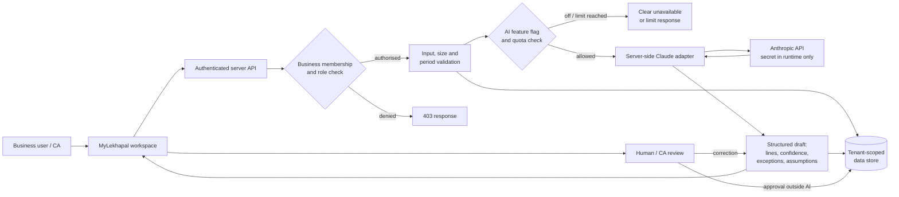
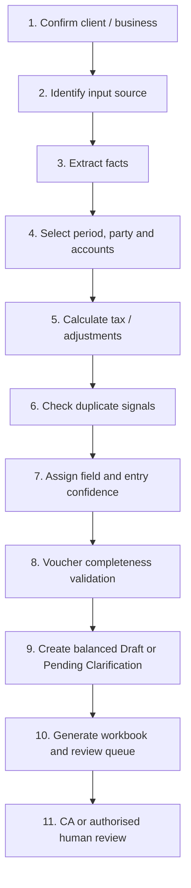
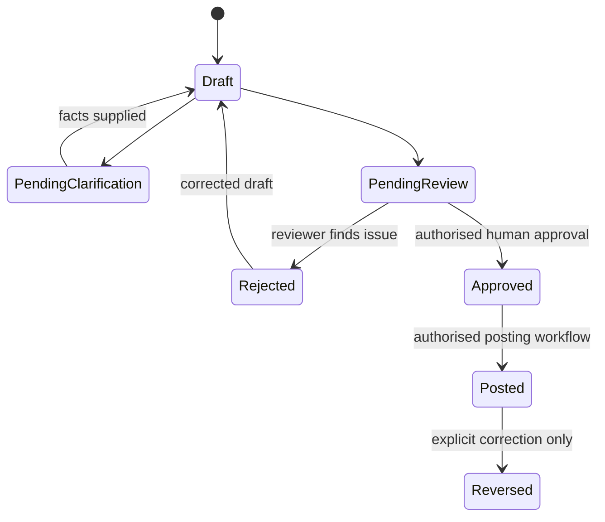

# MyLekhapal Claude Skill Architecture

## Purpose and boundary

The `my-journal-entry-preparation` skill is a **draft preparation service**. It accepts a user-confirmed business and a manual description, spreadsheet, or selected source document. It extracts facts, prepares balanced journal-entry drafts, calculates indicative tax workings where appropriate, records uncertainties, and creates a review workbook.

It never posts a journal, approves an entry, files a return, runs a background job, or receives a database credential, payment credential, Google OAuth token, or Anthropic API key.

## Runtime architecture



## Skill processing pipeline



Every entry starts as `Draft` or `Pending review`. Missing or inconsistent mandatory facts create an exception; the system does not invent a GSTIN, date, tax rate, account code, party, invoice number, or document.

## Access and tenant isolation

Each request must carry an authenticated user identity from the application session. The server resolves the selected `business_id`, then checks an active `business_memberships` record before querying or writing business data. The browser must never select another business merely by changing an identifier.

The present implementation uses Cloudflare D1. D1 cannot implement the design document's Postgres Row-Level Security policies. Before storing live financial records, move business data to Postgres and enforce RLS using `business_id` plus the active membership. Until then, every server query must continue to scope by business and membership.

## Data ownership and storage

| Data | System of record | Key rule |
|---|---|---|
| Journal drafts, lines, exceptions, audit events | MyLekhapal database | Always scoped by `business_id` |
| Original vendor documents | Vendor-selected Google Drive or temporary encrypted processing area | Store only a file reference, hash, and extracted fields after processing |
| Google OAuth refresh/access tokens | Server-side secret-managed token store | Never in D1, source code, prompts, or browser state |
| Anthropic key | Runtime secret manager | Never returned to the browser or logged |
| Review workbooks | User download or selected Drive destination | Explicit user action before export |

Google integration must use the narrow `drive.file` scope where it meets the requested feature. An export needs a preview and explicit confirmation; a disconnect stops sync and describes retained MyLekhapal records separately from files that remain in the vendor's Drive.

## Claude adapter contract

The server-side adapter should accept only minimised, tenant-checked accounting context:

```ts
type DraftRequest = {
  businessId: string;
  actorId: string;
  sourceMethod: 'manual' | 'excel_csv_import' | 'invoice_upload' |
    'receipt_upload' | 'bank_statement' | 'connected_system' | 'automated_recurring';
  transactionFacts: Record<string, unknown>;
  permittedAccounts: { id: string; code: string; name: string; type: string }[];
  priorDuplicateSignals: { reference?: string; date?: string; amount?: number }[];
};
```

The adapter returns a strict structured result, never executable instructions:

```ts
type DraftResult = {
  status: 'draft' | 'pending_clarification' | 'pending_review';
  confidence: 'high' | 'medium' | 'low';
  journalLines: { accountId: string; debit: number; credit: number; narration?: string }[];
  assumptions: string[];
  exceptions: { type: string; risk: 'low' | 'medium' | 'high'; requiredAction: string }[];
  sourceSummary: Record<string, unknown>;
};
```

The server validates account IDs, date/period, debit-credit balance, schema, size limits, and role permissions again after Claude responds. It records an append-only audit event and `usage_records` entry. An AI response never changes an entry to `approved` or `posted`.

## Review and posting state machine



The Claude skill may only create or revise drafts. A posted record is never edited in place; corrections create a reversal or adjustment with a link to the earlier entry.

## Workbook contract

The skill's deliverable is an `.xlsx` review workbook containing a Dashboard, Journal Register, normalized Journal Lines, Entry Details, Source Documents, Exceptions, and Review & Approval Status. Large imports use a compact register, one entry per row and one journal line per row. Each source row is accounted for as drafted, duplicate, failed validation, pending clarification, or excluded by the user.

## Controls required before enabling Claude processing

1. Add a server-side Claude adapter with a secret stored only in the host's runtime secret manager.
2. Add per-user and per-business rate limits, subscription caps, `usage_records` cost logging, and an emergency feature flag.
3. Move live financial data to Postgres and enable RLS policies for every business-data table.
4. Implement document hashing, temporary encrypted processing, deletion after extraction, and virus/content scanning.
5. Implement Google OAuth with selected-file consent and server-side token storage.
6. Implement reviewer/approver roles and approval-matrix thresholds.
7. Validate the workbook generator against realistic imports and independent accounting review.

Until these controls are complete, the `/api/ai` endpoint remains intentionally unavailable even if a runtime key exists.
